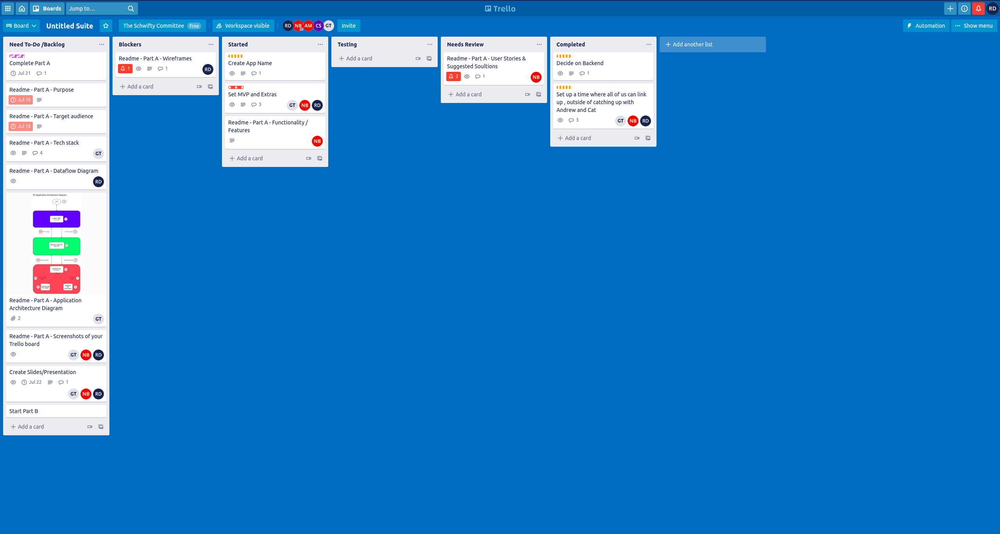
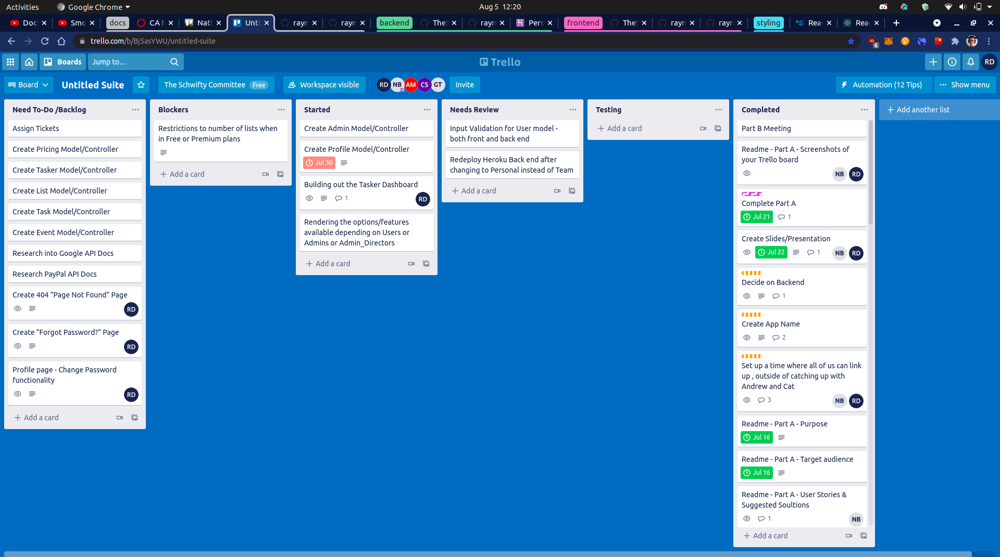
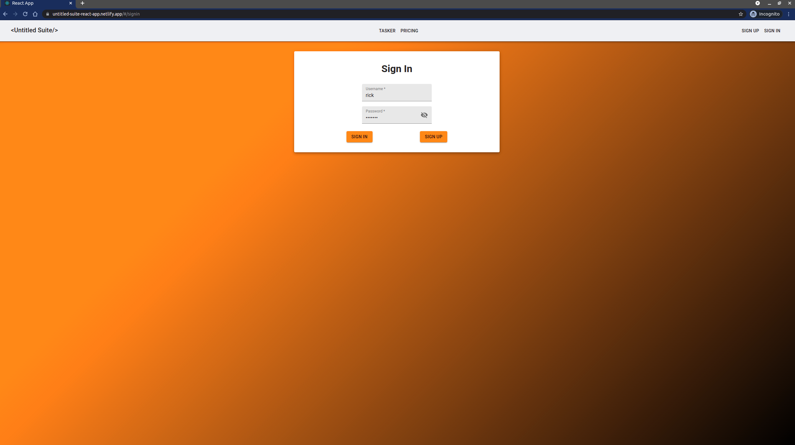

# Untitled-Suite

**The Schwifty Committee Repo / Source Code:**

[Link to the Organisation Repo](https://github.com/TheSchwiftyCommittee/untitled-suite)

**Front-End Repo:**

[Link to Front-End GitHub Repo](https://github.com/TheSchwiftyCommittee/untitled-suite-react-app)

**Back-End Repo:**

[Link to Back-End GitHub Repo](https://github.com/TheSchwiftyCommittee/untitled-suite-api-db)

Built by:

- Nathan Blaga [GitHub](https://github.com/NJBLAGA)
- Raymond Doan [GitHub](https://github.com/raymonddoan)

## **Front-End Instructions to Install and Run**

Follow the below steps to successfully install and run the front-end application of Untitled Suite.

1. Head over to the project's front-end GitHub page at `ttps://github.com/TheSchwiftyCommittee/untitled-suite-react-app`
1. Click on the green button labelled `code`
1. Copy either the `HTTPS` or `SSH link`.
1. In your terminal, head to the directory/folder of your choice (where you want to store the front-end application)
1. Type the following command `git clone xxxxxxxxxxxxx` (xxxx denoting the copied link from step 3)
1. This command will then proceed to clone the front-end repo to your local machine
1. Navigate to your local cloned copy by using `cd untitled-suite-react-app` in your terminal
1. Using `yarn install --check-files`, install the projects required dependencies.
1. Once the above command has finished, open the project using the command `code.` (if using `VS Code`) or the text editor of your choice.
1. Make sure the back-end API and server are running (following the instructions outlined in the  back-end GitHub Repo [here](https://github.com/TheSchwiftyCommittee/untitled-suite-api-db) ).
1. Once completed, run the following command: `yarn start`.

The `React Front-End` should now be running on `localhost:3000`.

Enjoy!

## **Back-End Instructions to Install and Run**

Follow the below steps to successfully install and run Prince Theatre.

1. Head over to the project's back-end GitHub page at `https://github.com/TheSchwiftyCommittee/untitled-suite-api-db`
1. Click on the green button labelled `code`
1. Copy either the `HTTPS` or `SSH link`.
1. In your terminal, head to the directory/folder of your choice (where you want to store the backend)
1. Type the following command `git clone xxxxxxxxxxxxx` (xxxx denoting the copied link from step 3)
1. This command will then proceed to clone the back-end repo to your local machine
1. Navigate to your local cloned copy by using `cd untitled-suite-api-db` in your terminal
1. Using `bundle install`, install the projects required dependencies'
1. Once the above command has finished, open the project using the command `code.` (if using `VS Code`) or the text editor of your choice

## **Setting up the Database**

Once the previous steps have been completed, it is time to set up your database. Navigate to your terminal and run the following line:

```r
# Creates a database for project
rails db:create
```

Once the database has been created, run the following line:

```r
# Runs migrations for the current environment that has not yet been run.
rails db:migrate
```

An optional step is to populate the database with pre made admins, users, lists ,and tasks, using the `seeds.rb` file. To do so, run the following command:

```r
# Seeds your database with pre made admins, users and listings.
rails db:seed
```

Once successfully completed, `Untitled-Suite's` database should be established and seeded, ready to run.

## **Active Storage/Cloudinary**

**_NOTE:_** If you wish to run another service such as `AWS` rather than `Cloudinary`, feel free to do so, however out of the box `Untitled-Suite` is already setup to utilise `Cloudinary` and `active storage`.

To set up this feature, open the project in a text editor. Once open, navigate to the `config` folder and delete the file named `credentials.yml.enc`

Now you can create your own by typing the following command in your terminal:

```r
EDITOR="code --wait" rails credentials:edit
```

This will open up a new credentials file, input the following:

```r
cloudinary:
  service: Cloudinary
  cloud_name: xxxxxxxxxxx
  api_key: xxxxxxxxxxxxxxxxx
  api_secret: xxxxxxxxxxxxxxxxxx
```

**_NOTE:_** You can find your `cloud_name`, `api_key` and `api_secret` on your cloudinary dashboard. If you do not have an account, create one here:

[http://www.cloudinary.com](http://www.cloudinary.com)

Once you have signed up (it is for free), you will be directed to your `dashboard`.

Once you have entered your credentials in the same way shown above, save and close the file. The following will be displayed:

```r
File encrypted and saved.
```

Now navigate to the file named `storage.yml` in the `config` folder and confirm the following lines of code are present:

```r
cloudinary:
  service: Cloudinary
  cloud_name: <%= Rails.application.credentials.dig(:cloudinary, :cloud_name) %>
  api_key: <%= Rails.application.credentials.dig(:cloudinary, :api_key) %>
  api_secret: <%= Rails.application.credentials.dig(:cloudinary, :api_secret) %>
```

Last step is to navigate to the `environments` folder within the `config` folder of your project. There you will see two files named; `development.rb` and `production.rb`

Out of the box, both are configured to store uploaded files on `Cloudinary` rather than locally. **_(No action is needed unless you wish to have files stored locally.)_**

All configuration needed to run `Untitled-Suite` alongside `Cloudinary` should now be completed and ready to run.

In your terminal, type the following command:

```r
#Runs rails server on port 4000(default)
rails s -p 4000
```

The `API back-end` should now be running on `localhost:4000`.

Enjoy!

## **How to Run tests**

### **Back-end Unit Testing - Rspec**

1. All `Untitled-Suite` testing files are located withing the `/spec/model` folders as shown below:


1. Using `bundle install` as instructed above, all of the projects required `dependencies` and `gems` will be installed -- including the gem `rspec-rails`.
1. Within a terminal run either of the following commands `rspec spec` or `rspec spec --format documentation` from the root directory of cloned your project.
1. Rspec will then display the following in your terminal:


### **Front-End Unit Testing - JEST and React-Testing-Library**

1. Unit testing files are located within the same folders as the files they are testing (ie. `App.test.js` is located in the same folder as `App.js`).
1. Using `yarn install --check-files` as instructed above, all packages required for the application listed in the `package.json` file will be installed.
1. Within the same terminal, run the following command `yarn test` from the root directory of your cloned project. Note: `yarn test:coverage` can also be run to retrieve the test coverage results.
1. The terminal will then display the following in your terminal:


### **Integration/E2E Testing - Cypress**

1. For Integration/E2E Testing files, these files are located within the `/cypress` folder as show below:


1. Similar to the unit tests, once all the packages are installed using `yarn install --check-files`, run the client using `yarn start`.
1. In a different terminal, run the following command `yarn cypress:open` from the root directory of your cloned project to run cypress. The following menu will pop up:


1. Once completed, click on the button `Run integration specs` on the top right of the pop up.
1. You will be taken to a virtual Chrome browser and show the following results:


## **ERD**

Throughout `Untitled-Suite's` API development, several key aspects were altered and changed based on the changing state of the application's `MVP`. The `ERD` of `Untitled-Suite` will continue to change and alter as new features are development and implemented.

### **Version 1:**


### **Version 2:**


### **Version 3:**


### **Version 4:**


## **Live Visuals of Untitled Suite**

### **Create Profile Page:**


### **Update Task Page:**


### **Users Page: (Admin Dashboard)**


## Background/Problem

Whether on a professional level or for personal projects, task management is an effective and efficient tool for project management. "Task management is the term used to describe how project managers identify, monitor, and track the progress of work that needs to be completed on any given day" (Santos 2021). Task management is critical for the effective development and handling of any project, big or small.

Moreover, with the current global pandemic of COVID-19, millions of people have been working remotely, adding more strain to the day to day dealings and processes of most projects. More than ever, project teams and individuals working from afar highlights the importance of task management and handling project development in a agile and organised manner.

## Importance

Task management allows teams and individuals to approach a project with a proactive mindset rather than a reactive mindset. Creating roadmaps, procedures, and time frames are essential components of project management. They allow for more efficient and effective development, testing, reviewing and implementation, rather than reacting to events that are beyond the scope of the team. "Managing tasks ensures that teams are able to prioritize their workloads and guard against time-wasting. It is absolutely imperative in the social media age" (Santos 2021).

Task management through an application such as Untitled Suite can produce many benefits to a project's team when handled in an efficient and effective manner. These benefits include but are not limited to:

- Prioritising tasks through a projects lifecycle
- Creates snapshots of the current project and allows a high-level view of the project all at once
- Reveals time constraints and the available time frame for each task
- Aids in optimisation of grouping or sorting tasks in order of prioritisation which in turn aids in a more efficient scheduling system
- Allows management and team members to work efficiently, effectively and at their maximised productivity levels within their own workloads and time frames
- An automated process which is flexible, tailored to each project and team
- Easy learning curve and utilisation allows for easy flow of mindsets and working habits

## Purpose

Untitled Suite's original intention is to provide project managers and their teams a one-stop shop for optimising task management. Whether for the development of a major multi-billion dollar project or a do-it-yourself project around the house, Untitled Suite aims to remind the user of the important things in life. Through its smooth interface and user-friendly experience, the application is one for the modern day agenda. From task management, daily chores around the house, to tracking and planning your own health or personal growth, Untitled Suite offers efficient and effective tools to optimise your work, your lifestyle, you.

## Functionality / Features

### User Account/Profile

Untitled Suite allows a user to create a unique account. Accessing this account upon login will allow users to do the following:

- Modify their profile settings and account details
- View, update and delete any of their saved lists within Tasker
- View, update and delete any tasks within a certain list
- View, update and delete the current state of their calender
- View, update and delete upcoming events stored within the calender
- Review a backlog of calender events that have passed

This feature allows users to customise their Tasker, calender and overall user experience to better suit their taste and style. This results in a more fluent and comfortable atmosphere in which users can feel more attached by giving a personal touch to their workflow.

### Admin Dashboard/System

The admin system allows a user who has administrative privileges to log into Untitled Suite and perform routine tasks such as:

- Delete the account of any user who is in violation of Untitled Suite's terms and conditions
- Delete the account of any user who breaches the Untitled Suite's payment policy
- Review and allow administrative privileges to any user who fulfills the required screening procedures

All of the above tasks can be accessed from the Admin Dashboard which acts as the central hub for all admin. This feature will not be able to be viewed or accessed by any user who is not classified as an admin.

### Paypal Integration

Upon signing up, Untitled Suite offers users a trial tier of the application. This allows the user to:

**Trial Tier:**

- Users can create up to 5 unique lists within Tasker at any given point
- Users will have the ability to create and store unlimited tasks inside these entires
- Users will have access to their calender

At any point, users can purchase the premium tier for AUD $5 per month. This allows users to:

**Premium Tier:**

- Users can create unlimited lists within Tasker at any given point.
- Users will have the ability to create and store unlimited tasks inside these entires
- Users will have access to their calender

### Responsive Navbar

Untitled Suite offer its users a responsive and stylish navbar that allows for a smooth experience while navigating between the various components. Built with a mobile first development mindset, the navbar and overall design of the application is handled gracefully across all platforms and devices.

### Responsive Design / Mobile First Design

Utilising Material-UI, Untitled Suite is built with the sole intention to approach any task with style and charisma. The design of the application was built for the mobile user on the go, the office desktop and for the home tablet. It offers a sleek and polished professional look and feel, while offering a personal touch to make the user experience that little bit more enjoyable and smooth. Untitled Suite utilises space and functionality of all its components which delivers the user's tasks and events in a presentable and elegant manner.

### Tasker

Tasker allows users to create, update and delete any list or task created by their account. Whether on the trial or premium tier, Untitled Suite allows users to create lists within Tasker alongside setting tasks to each list. While creating a task, users can set a description, priority and reminder date. Users will also be able to choose which list the task will be allocated to.

### Integrated Calendar System

The calender allows users to create, update or delete events they hve created. Additionally, users can link Tasker lists and their tasks to certain events within the calender. Through its user-friendly interface, users can navigate with ease through past and future events they have set within the calender.

## Target Audience

Untitled Suite's primary goal is to offer its users an efficient and effective way to handle and succeed at task management. Whether working on a home project, personal growth, charity work or on a professional level, Untitled Suite offers a solution for any user. Its elegant and smooth design allows for any user to create an account, sign in and start using Tasker to create lists, track tasks and set events. However the target audience for Untitled Suite's initial launch will focus on several key groups that will benefit greatly from using the application, which is demonstrated below.

### Business Professionals

Focusing on task management teams, both team leaders and the members themselves can benefit from the implementation of Untitled Suite within their task management procedures, project management and agile development mindset. With stable and efficient features, Untitled Suite can aid professionals in the optimisation of defining, planning and completing tasks in a proficient and effective manner.

### Education Sector

Untitled Suite offers the educational system a tool in which teachers and teachers assistants can better plan the upcoming semester or even year. From weekly, monthly and yearly scheduling, any school system can implement Untitled Suite and benefit from its user-friendly design and smooth functionality. Tasker can also benefit the classroom by allowing teachers to formulate well structured plans for the semester. By utilising the calender feature, they can also create a more efficient flow of work by setting reminders and events.

### Small Business Owners

Small businesses, both in Australia and on a global scale, have suffered great losses throughout the COVID-19 pandemic. Whether through government aid or self-determination, many of these business are beginning to rebuild, restructure and reopen. This requires great communication, planning and task management between the owners and their workforce. Untitled Suite can dramatically aid in the rebuilding and reopening process by removing some of the hassles of manually handling the task management process. Utilising Tasker, a business owner can define and set the necessary tasks needed to fulfill their projects and target goals. In turn, those tasks can be transferred to the calender feature, offering employees a top-down perspective on clear time frames, reminders, events and priorities in which tasks need to be completed, reviewed and implemented.

### Home Use

The Australian public during the COVID-19 pandemic were asked to work, school and live from home for weeks and months on end. During this period, many Australians commenced home projects, hobbies and self growth journeys. Untitled Suite can benefit Australians with defining, setting and tracking the individual tasks needed within these projects. Providing a user-friendly interface alongside the applications portability between any device allows any user to track their new garden project, their weight loss journey or even feeding schedules for newborn babies. Untitled Suite aims to not only solve task management on a professional level, but is here to remind you at home about the important things in life.

## Tech Stack

### Application

- `React` and JavaScript for Front-end
- `Ruby on Rails` for Back-end Server
- `PostgreSQL` for DBMS (Database Management System)

### Testing

**Front End Unit:**

- `Jest` used for main JavaScript testing framework throughout the project
- `Testing-library/react` used for testing React components

**Back End Unit Testing:**

- `RSPEC` used for behaviour-driven development of the back-end

**Integration/E2E Testing:**

- `Cypress` used for end-to-end, integration and unit testing

### Gems

- `JWT` used for adding authentication
- `Bcrypt` used to create password digests and authentication logic
- `Puma` used as local testing server
- `RSPEC-Rails` used for behavior-driven development of the back-end

### Libraries/3rd Party API

- `Material-UI` for CSS framework
- `Axios` used for fetching data from the back-end
- `React-router-dom` used to create a multi-page application

### Deployment

- `Netlify` for front-end deployment
- `Heroku` for back-end database/API deployment

### DevOps

- `GitHub` used as a code hosting platform for version control and collaboration
- `Trello` used as team's collaboration tool and task management
- `Discord` used as main form of communication between team members

## Dataflow Diagram

Untitled Suite can be broken up into three main processes or functions: Users, Tasker and Calendar. Both the Users and Tasker functions contain sub-processes within, which have been shown in the further breakdown. The legend in the top left corner depicts what each of the symbols represent:

- External entities reflect entities outside of the application and are represented by yellow curved rectangles.
- Processes and sub-processes reflect how the data and its flow are manipulated, which is shown using the blue curved rectangles with a header. These headers reflect the collection of the processes respective to their function.
- Data stores or databases reflect where the data is stored and are represented by green curved rectangles with a row header.
- Data flows reflect the data that is moved and its path across various processes and data stores. These are represented in arrowed lines with the arrow head indicating the end destination.

At 'Start Here', for `Guests` to access Untitled Suite, they are required to provide their details to either create an account (`1.0`) or log into their account (`2.0`). This will be checked against the `Users` database before authorising the guest as an administrator (`Admin`) or `User`.


### Users Dataflow

Once logged in, the `User` will interact with their account settings. Within the account settings, `Users` can view and manipulate the data including:

- Email and password through `Profile` database
- Subscription plan through `PricingPlan` database

For `Admins`, they will be able to perform RUD requests to the `Users` database by passing in the updated user details. `Admin` provisions will be set in the `Users` database. `Users` cannot be created through the `Admin` role as only `Users` will be the creator of their own accounts for security purposes.


#### Profile Dataflow

`Users` will be able to view and update their profiles through the `Profile` database. Parameters such as `userId` will be passed to check and show the `User's` profile.


#### Pricing Plan Dataflow

Similar to the `Profile` dataflow, `Users` will be able to view and update their subscription plans through the `PricingPlan` database, where `Users` who have paid for the premium service will be shown.


### Tasker Dataflow

As one of the core features of the application, two databases are required for the Tasker component to function, `Lists` and `Tasks` databases. The `userId` parameter is passed into the databases to collect their relevant information.


#### Lists Dataflow

Full CRUD functionality is available for the `User` to generate unique `Lists` where `Tasks` can be added.


#### Tasks Dataflow

Similar to `Lists`, dataflow in the `Tasks` component will be managed through the `Tasks` database. All CRUD functionality will be passed through the `Tasks` database.


### Calendar Dataflow

Similar to `Lists` and `Tasks`, all calendar events set by the `Users` are shown and can be accessed through the `Calendar` database, where `userId` will be cross-referenced against the `userId` field in the database.


### Joining Tables Dataflow

Two major components to integrate `Tasker` and `Calendar` are joining tables as shown below. These will be set up within the `Rails API` such that:

- Lists will be a one-to-many relationship with Tasks, and;
- Calendars also have a one-to-many relationship with Tasks.


## Application Architecture Diagram


The above Application Architecture Diagram illustrates the various components that comprise Untitled Suite's architectural framework. The diagram denotes how each component is handled on a individual level and how they function within their various interactions with other components.

### Front-end Component

`React` handles the front-end for Untitled Suite. When a user accesses the application, they are directed to the Untitled Suite's landing page. React renders everything from the navbar system, landing page to login/sign-up forms to the users browser. Untitled Suite's front-end (React) will be deployed on `Netlify`.

### Back-end Component

Untitled Suite's back-end (database/API) will be deployed on `Heroku` through continuous delivery. Untitled Suite's is handled by `Ruby on Rails` back-end. Utilising fully functional `CRUD` implementation for users allows them to create, read, update and delete the following:

- Account/Profile settings
- Lists within Tasker
- All individual tasks within each list
- Calender Events

The back-end will also allow Admin to perform `CRUD` functionality in relation to the following aspects:

- View user account
- Upgrade user account to Admin status
- Delete user account

### Database Component

Untitled Suite's relational database will utilise `PostgreSQL` to store and provide access to data points that are related to one another. Using a relational model allows Untitled Suite to form relations between the `user model` and the various other `models` within the database. An example would be that of a user and their `Lists` - a user can have many `Lists`, however any given `List` can only belong to one `user`. This in turn suggests a `one to many relationship`.

### Cloud Service Component

Untitled Suite will utilise `AWS` cloud based services to host its database. This will allow Untitled Suite to store data and information such as:

- User account details (username, password, image avatar, profile settings, payment details, payment history, current tier)
- Current `Lists` within `Tasker` under that user's account id
- Current `Tasks` within above lists under that user's account id
- Calender `Events` belonging to each `User`

### Testing Framework Component

- Untitled Suite's front-end utilises both `Jest` and `testing-library/react` frameworks for its testing purposes. Both JavaScript logic and React components are tested to ensure Untitled Suite runs efficiently with minimal errors, bugs and poor user experiences occurring.
- Untitled Suite's back-end will utilise the `Rspec` gem for testing the various back-end components.
- `Cypress` is utilised to test various components within Untitled Suite's framework and integration testing.

### 3rd Party API/Libraries Component

- The `Axios` library is utilised to fetch data from the API end-points. Performed with an asynchronous mindset alongside error handling and testing, data will be successfully retrieved and rendered to the user.
- The React front-end entire styling and design framework for Untitled Suite will be handled by the Material-UI framework.
- The `controller` within the `rails` back-end will be able to access the `Paypal developer API`. This will allow the `user model` to instruct the database to link `user profiles` to their payments and grant them the `premium` tier benefits.
- The `controller` will also be able to access the `Google Calendar API` and utilise its extensive library to create the framework for the application's calendar feature.
- The `Rails` back-end will also utilise the `Devise` gem and its various modules to create a flexible authentication solution for Untitled Suite's user base. Additionally, alongside the user model and restrictions within CRUD functionality, `Devise` will handle and set a range of accessibility on pages that contain particular user information

### User Example

A user logs into the Untitled Suite application when they wish to create a new `List` within `Tasker`. `React` will render the new list page within the `Tasker` feature. `React` will then utilise `Axios` to fetch the `user-lists` endpoint from the `API`. Through `Devise` and back-end `controller`, the fetch request will be queried within the database to verify several key factors:

- Does the current user `id` exist?
- Does the current user `id` hold the `trial` or `premium` tier ?
- If the current user is on the `trial` tier, have they exceeded their 5 `List` limit?

If the current user can create a new list within `Tasker`, the `PostgreSQL` will send the `Controller` a response allowing the action to take place. The back-end will then send a response back to the front-end. `React` will then handle that response and render the relevant components and information to the user. Although the above example denotes a simplistic description on how the above action is handled within Untitled Suite's architectural framework, it demonstrates how each component within the framework handles it primary duties and many interactions with each other.

## User Stories

- As a user, I want to be able to create an account/profile.

**Solution:**

Utilising the `Devise` gem, Untitled Suite will have an authentication structure for all users and admins. Users will only be able to access `Tasker` that belong to their unique profile id.

- As a user, I want to be able to customise my profile avatar, colour scheme and details.

Untitled Suite will provide all users with the ability to change and edit their avatar, colour scheme and details. Through the profile section located within the navbar, any user can access their profile dashboard and have access to such features.

**Solution:**

- As a user, I want to be able to create to-do lists/checklists.

Once a user is logged in, Untitled Suite allows them to create up to 5 `Lists` at a time. Once a user has upgraded their account to premium level, they then have the ability to create unlimited `Lists`.

**Solution:**

- As a user, I want to be able to have my to-do lists and calender linked.

**Solution:**

Through Untitled Suite's smooth and user-friendly interface, any user can access the calender or their personal `Lists` from anywhere throughout the application. The user will also have the ability to link certain `Lists` to particular days, weeks or months within the `Calendar`. This allows the users to set time-frames and reminders within their profile's `Calendar` in accordance with particular items requiring attention.

- As a user, I want a user-friendly interface that can function on desktop, tablet and mobile devices with a simplistic design and responsive navigational layout.

**Solution:**

Utilising the extensive library offered by `Material-UI`, Untitled Suite will provide a very smooth and rich experience in relation to its interface and overall design. The ability for all users to customise their profiles in accordance with their own styles and workflow allows Untitled Suite to provide users with the ultimate utilities experience mixed with each user's personal touch.

- As a user, I want assurance of my accounts privacy and safety.

**Solution:**

Utilising `Devise's` extensive library of security features in addition to built-in protocols allows users to create their own profiles, login and use the application within a friendly environment.

- As an admin, I want access to the admin dashboard.

**Solution:**

Admin will be able to log into the application and have access to an admin dashboard. This will act as a hub in which all admins can access the application through a unique way. The Admin dashboard will only be accessible to users who have the status of `admin`. Other uses will not have access or vision of the dashboard within their experience of the application.

- As an admin, I want to be able to view all users.

**Solution:**

Within the Admin dashboard, admin have access to all current users within the application's database. The dashboard will not only display all users, but allow admin to perform various actions (mentioned below).

- As an admin, I want to be able to delete a user profile.

**Solution:**

One action available within the dashboard to all Admin is the ability to delete any user. The ability to delete an account will only be exercised if said user has broken or violated the terms and conditions of the application. The deletion of any user is a permanent action and can not be undone once performed.

- As a admin, I want to be able to assign users with admin status.

**Solution:**

The Admin dashboard allows the Admin to also promote users to Admin status. This feature allows for the growth of the admin staff as the growth of the application increases. This action should be performed with caution and only be used once a user has gone through sufficient screening.

### Testing libraries used in the app

#### **Rspec:**

The `Rspec` gem was selected as the back-end's primary testing framework for the following reasons:

- performs fast tests
- very good for unit testing, that is testing models and controllers
- easy and clear to understand
- clear failure reports
- elegant when using mocks and stubs for data

The above points are only some of the benefits a project such as `Untitled-Suite` will gain when utilising the `Rspec` framework. Through `Rspec`, a more complete and developed back-end was formulated, allowing for a more rich and user-friendly experience to be given. Although the testing for the back-end was conducted on the models only, `Untitled-Suite's` road map will focus on greater testing coverage of the APIs `models` and `controllers`.

#### **Jest:**

`jest` is the default testing library for React Applications and is perfect for Unit Testing because of the following reasons:

- offers a CLI tool to control your tests easily
- comes with an interactive mode that automatically runs all affected tests since change
- provides excellent documentation with plenty of examples and a supportive community.

The default methods and helpers available from Jest is great for `Untitled-Suite`. The lightweight library and user-friendly experience was perfect to testing the front-end and the terminology is extremely easy to understand.

#### **React Testing Library:**

`@testing-library/react` is a great package with similar syntax to `jest` and makes it an amazing library to fill in the gaps of `jest`. This package was mainly utilised to trigger events (ie. onClick and onChange handlers) with the `fireEvent` method and rendering components with the `render` method. Other benefits of the library include:

- Enabling quality tests to be written to ensure complete accuracy.
- Offers a way to find elements by a data-testid for elements
- Avoids testing the internal component state.

#### **Cypress:**

Cypress is supported across multiple platforms (ie. Chrome, Firefox and Edge browsers). Cypress executes them in real-time as developers write code, which makes it easily accessible and responsive to use.

- Cypress framework captures snapshots at the time of test execution.
- Cypress waits automatically for commands and assertions, compared to other integration testing frameworks.
- The automatic scrolling operation ensures that an element is in view before performing any action (ie. Clicking on a button).

## Wireframes

The initial wireframes designed for Untitled Suite aim to maintain a basic structure and layout during the development and production cycles. After discussions with stakeholders, some elements were modified and/or removed to cater for the MVP the clients sought. Below is a breakdown of all wireframes and any changes that occurred during the design process. It should be noted that in these initial designs, Untitled Suite maintained a mobile first design and will look to the future to continuously improve its design.

### Colour Scheme

Untitled Suite encourages creativity and enthusiasm throughout the project management process, despite the blank canvas the name suggests. To resemble this in the application, orange `#ff8e3c` is the primary colour used to convey this to the user and is a perfect colour to draw attention to the main features of the application. For more details, [here](https://www.happyhues.co/palettes/9) is the combination of the colour scheme.

### Home Page

The home page is designed to give a brief introduction to the application and give Call-To-Actions (CTAs) for the user to sign up or login. The minimalism to the home page aims to help the user understand the simplicity of the application.


### Tasker Dashboard

Once logged in, the user is brought to Tasker as their default page. Here, the user will be able to view all of their tasks, with the first being the tasks associated with today. It is a simple UI with the CTA buttons in orange and the Lists listed at the bottom of the page. Pagination was an initial idea discussed to achieve the list of the tasks, however was overruled with a scrolling capability to maintain the single page application (SPA) aspect.

The layout of the application with the agenda to the side of the tasks was requested as it assists with the usability of the web app and helps manage the reminders of the tasks along with the meetings throughout the day. This component will be hidden on the smaller screen sizes to give more space to the core feature of the page.

Users can create new tasks and lists on this page by clicking the `Add New Task / List` button. An untitled task / list will be shown above the button where the user will be prompted to type in the title of the task / list.


### Tasker - Edit / Delete Task Page

In the event of the user modifying the task, users can select the dot on the right side of the task to change details such as title, description, reminder date and many more.

A calendar prompt will be shown once the `Reminder Date` is selected and set by the user. `Select List` will allow the user to associate the task with the list they have created prior to the task, which can be found at the bottom of the Tasker dashboard. `Select Priority` will allow the user to set the level of priority for the task.


### Calendar Dashboard

Below is the default view of the Calendar dashboard, with Tasker on the left of the calendar and the weekly view as default for the user. Similar to the agenda feature in the Tasker dashboard, the Calendar dashboard hides the Tasker list in smaller screen sizes and gives more space and functionality to the Calendar. In these smaller screens, users will be able to create events with the `+` button on the bottom right of the screen.


### Calendar - Add New Event / Edit Event Page

Here, a modal component or pop up will appear on the screen when the user decides to add a new event or modify an existing event. Start and End dates are provided for the user to create the length of their meetings as well as description box for more in-depth details to the meeting.


### Admin Page

Administrators of the application have special provisions to the application such as adding and removing users. `Update Selected` and `Delete Selected` are capabilities for the administrator to conduct actions in bulk or for various users.


### Profile Page

Profile page will allow users to update their details on the application, such as their email and passwords. The username will be the source of truth and grant them access to Untitled Suite.


### Login Page

Here is a simple login page for the users to log in into the application.


### Sign Up Page

Similar to the login page, here is a simple sign up page where the user will be able to enter in their desired username, email and password to login into the application.


### Pricing Page

Finally, here is the pricing page that that is linked to a Paypal page where the user can pay for a subscription fee to upgrade their account and have access to the premium tier of the website.

In mobile view, the users will be able to scroll left to right to view the Premium option.


## Trello Board

For snapshots of the progress of our Trello board, check out the `docs/trello-board` folder. For access to the Trello board, here is the [Link to the Trello Board](https://trello.com/b/Bj5asYWU/untitled-suite) (shoot a message to Nathan or Ray for managing access).

### **Part A - Trello Board Screenshots**

### Day 1 - Kickoff Meeting

- Discussed and completed research on the issue the application was trying to solve.
- Set up Trello board and created tickets for Part A.
- GitHub organisation and repository were set up.
- Local repositories and remote branches were organised and set up.
- In addition to the standup meetings with Educators, weekly group meeting schedules were set for the duration of the project.


### Day 2

- Discussed and finalised the various technologies to be used within the project's Tech Stack.
- Discussed and finalised the application's MVP, any optional features, alongside its overall functionality.
- Researched examples of how particular criteria within the project's rubric were to be addressed.
- Task tickets were assigned time frames and priorities.
- Task tickets were assigned to each member.




### Day 3-4

- Nathan completed the following sections of the documentation:

1. Purpose
1. Target Audience
1. User Stories
1. Features and Functionality

- Raymond continued to work on wireframes designed within Figma.
- Third team member decided to leave.
- Features and functionality had to be recessed within time constraints and available resources.
- Once redefined, tickets were reassigned to remaining members.


### Day 5

- Nathan commenced working on the Tech Stack section.
- Nathan reviewed the MVP and Extras ticket.
- Raymond worked on resolving the 'Wireframes' blocker.
- Raymond completed the Wireframes and their description within the documentation.
- Raymond commenced working on the Dataflow Diagrams.


### Day 6

- Nathan completed the Tech stack section and requested Raymond to review it.
- Nathan commenced working on the Application Architecture Diagram using draw.io.
- Raymond continued to work on the Dataflow Diagram.
- Raymond started reviewing the Tech Stack section.


### Day 7

- Held a meeting with Educators in the morning to discuss questions around the AAD and DFD sections of documentation.
- Nathan completed AAD and requested its review.
- Raymond completed DFD and requested its review.


### Day 8

- Reviewed remaining components (tech stack, AAD and DFD).
- Nathan conducted a full documentation review.
- Raymond worked on the presentation.


### Day 9 - Part Submission

- Raymond finished the presentation.
- Both Nathan and Raymond presented Untitled Suite to the class.
- Took the final screenshot of Trello Board, indicating the completion of Part A of the assignment.


### **Part B - Trello Board Screenshots**

Below are screenshots of various stages of Part B of the project. This time period consists of the following processes:

- The creation of the Front-end Repo on GitHub
- The creation of the Back-end Repo on GitHub
- The creation of the Part-B Repo on GitHub
- On-going Research into the different Technologies and Libraries utilised throughout Untitled-Suite's development and production
- Resolving bugs, issues and failures between the front-end and back-end
- Allocation of Part B tasks
- Scheduled meeting every Monday between both parties
- Uniting Testing for Front and Back end (Jest, React Testing Library, Rspec)
- End 2 End testing of Cypress
- Deployment of both ends (Heroku and Netlify)





### Production - Testing

#### User 1 - New User Experience

Below is `Untitled-Suite's` Production testing from a new `User` experience and POV. The New User was instructed to head over to the applications url: `https://untitled-suite-react-app.netlify.app/#/`. Once the home page was loaded, the New User was asked to explore the application. The following images were taken throughout the User's experience.

- User arrived on the home page successfully.


- User created a new account
  
  

- User successfully created their new account and was redirected to the profile creation page.


- The User successfully creates their profile and is redirected to the Tasker page.


- The User heads back to their Profile page and decided to update their Avatar image.


- Image is successfully uploaded and displayed back to the User.


- The User decides to head over and check the pricing page.


- The User heads over to the Tasker Page, and creates a new List.


- The User successfully creates the List `Fred's List`.


- Within the List, the User creates a new Task.


- The Task is successfully created.


- The user than creates a new Task and it to is successfully created.


- The User decides to Updates Task 2.


- The User is prompted with a Update Screen and makes changes.


- Due to the Task being completed, Tasker shows that Task as a different colour indicating to the User, the Task has been completed.


- The user then decides to delete Task 2.


- The action is successfully completed and Task 2 was deleted.


- The User then wishes to update the List name and begins to do so.


- The User is prompted with a Update Screen for the List, and begins to change the List Name.


- The action was successfully completed and the List has a new Name.


- The User then decides to create 2 new Lists.


- The actions is sucessfully and Tasker displays the new Lists to the User.


- The User then uses the Search function to look up all Lists that start with `b`. The Search function returns 2 results.


- The user then decides to end the testing session by Signing out of their Account.



The User provided feedback to their experience and the Application's functionality and overall deign.

- Very User-friendly
- No errors or bug were encountered
- Smooth Design
- They had wishes that the Profile customisation feature was out.
- Overall very effective at creating lists and tasks.

#### User 2 - Admin Experience

Below is `Untitled-Suite's` Production testing of an `Admin` User.

- User Sign-in and accessed the `Admin Dashboard` Page.


- The Admin expanded their search for all `Users` on the application.


- The `Admin` used the `Search Function` to find the `User` of choice.


- The `Admin` `Assigns` the `User` to `Admin` status.


- The `Admin` `Un-assigns` the `User` to `User` status.


- The `Admin` `Deletes` th `User` from the application database.


- The `Admin` uses the `Search Function` to find the `deleted User`, no results were found. The `deletion` was successfully.


The `Admin` provided feedback to their experience and the Application's functionality and overall deign for `admins`.

- Easy for `Admins` to perform their daily tasks and functions.
- No errors or bug were encountered during the `Admins` testing.
- Some form of `messaging system` between `Admins` and `Users` would benefit the application.

## Additional Features for Roadmap - Whats next?

Looking beyond Untitled Suite's initial release, the number one priority will be to enhance the user's experience by empowering their workspace alongside improving the overall functionality and security of the application.

### Admin Dashboard Updates

Through the intergration of an inbuilt messaging system and robust notification system, the admin dashboard will house the tools that will allow admin to handle the following tasks:

- Manage and resolve any user complaints
- Review and report any technical issues or bugs

### Single Sign-On (SSO) productive

The future of Untitled Suite will see users have the ability to create and log into their accounts using SSO, allowing for more connectivity between the application and their emails, Google account and social medias. This will allow for a more fluent and productive experience on a professional and personal level.

### Profile Customisation

When a user logs into their account, they can access the profile customisation feature to allow them to perform the following actions:

- Update and change their profile avatar image
- Change the colour scheme and background design of their profile within Untitled Suite

### Friends List

Users are able to add other users and create a `Friends List`. From the `Friends List`, a `user` can then invite their friends to join them for `Events` set within the `Calendar`.

### Create Teams

Users can take friends from their friends list and create teams. Teams will be able to share lists within `Tasker`, allowing them to create, edit and delete `Tasks` alongside constructing team events within the `Calendar`.

### Note-Taking Feature

Untitled Suite will add a new addition to its suite of tools in the form of a fully functional `Notepad`. This will allow users to create, edit and delete documentation on the fly. Additionally, users can utilise a copy and paste functionality between `Tasker` and the `Notepad` for easier and more productive sessions. The notepad will also be linked to the `Calendar` allowing users to save and attach meeting minutes and ideas from the notepad with any given `Event`.

## **Self-Reflection**

### **Nathan:**

- The Project allowed me to express myself in a very creative and logical manner.
- The creation and implementation of an API allowed me to further develop my Rails and back-end skills an knowledge.
- Although I did not undertake a Test Driven Development Approach towards this project, it did allow me to achieve a better understanding on unit testing practices through the Rspec.
- In turn it has driven me to not only focus on improving my knowledge base and understanding on unit testing, but inspired me to undergo further development into Test Driven Development.
- I believe further progression down this path will result in a more efficient and effective code-base/solution.
- I believe my strengths lay within documentation and Rails.
- Utilising these strengths allowed myself and Raymond to take advantage and build the application with little downtime.
- Working with Raymond was a joy and very rewarding.
- He is a hard-working developer, whose knowledge of the front-end resulted in a stunning and smooth user experience.
- Raymond was always at the fore-front of solving any issues.
- Great communication between us two on a daily basis meant there was no lack of information between the front and back ends.
- Raymond was also very easy to discuss blockers with and always aided in helping me with any of my issues.
- It was great to not only work within a team on a major project for the above reasons, moreover the ability to pass knowledge between each other was a great bonus.
- Adding to the above point, learning was such a critical component to this experience and project. Both of us learnt so much as a team and on a personal level.

### **Raymond:**

- Benefits

This project was great in learning how to build a Full Stack application and integrating between applications built on different languages. During the front-end development, learning new technologies, such as Cypress and React Testing Library, are great in getting me prepared for the real-world technologies.

- Learnings

Using agile project management tools such as Kanban boards on Trello is a great way to keep track of tasks needed to be done. Also, the persistence and perseverance to try and solve a problem is the key to learning and increasing my knowledge. However, being aware and knowing when to reach out are also key points I have taken from this project.

- Strengths

Front-end development is definitely my passion and strength to the coding community. Designing visually appealling applications and designing the app's functionality (connecting to REST APIs, search and filtering data, constructing tables will unique functions) are my key takeaways of the application.

- Teamwork

It is really understated how important teamwork really is when designing the application, especially on this scale. Nathan was an amazing teammate to work with and extremely assisting when I had issues calling to the back end. Quick reactions and consistent meetings between us helped develop the application in a timely fashion.

## References

- Santos, J 12 October 2021, Best Management Software & Tools, apps, project management software reviews, reviewed 15 July 2021, [https://project-management.com/task-management-software](https://project-management.com/task-management-software)
